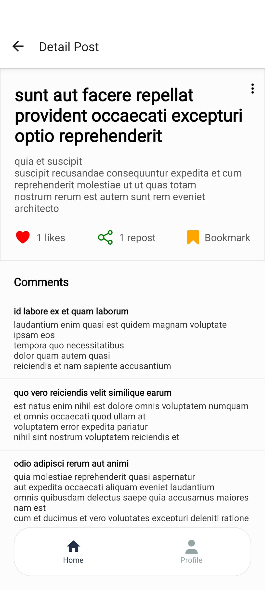
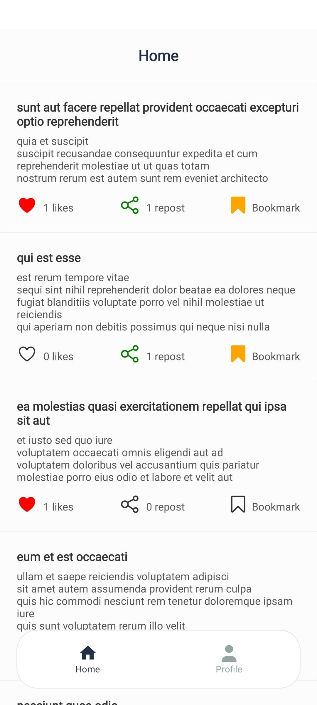
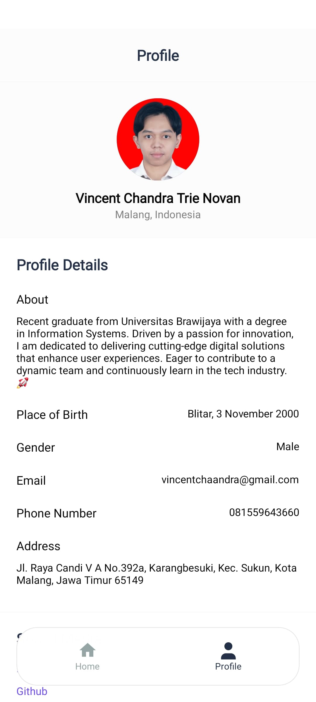
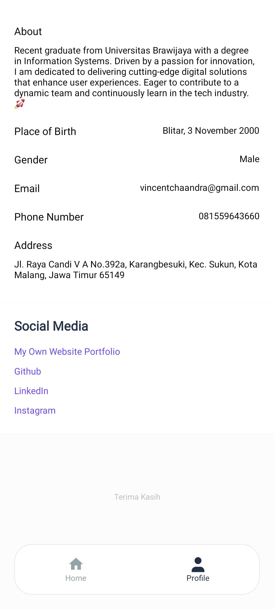

# Mobile App Technical Test Sekawan Media

Proyek ini adalah aplikasi mobile yang dibangun menggunakan **Expo React Native Blank Template** sebagai bagian dari technical test untuk **Internship Sekawan Media**.

## 📂 APK Installer
File **APK Installer** dapat diunduh melalui link berikut:

https://expo.dev/artifacts/eas/bZKMhSUeQXYeoQMYL811NT.apk 

## Screenshoot Aplikasi





## 🚀 Cara Menjalankan Aplikasi

Pastikan Anda telah menginstal Node.js (v22.13.0) dan Expo CLI di sistem Anda.

### 1. Clone Repository
```sh
git clone https://github.com/vchandra22/mobile-app-skwn.git
cd mobile-app-skwn
```

### 2. Instal Dependensi
```sh
yarn install
# atau gunakan npm
npm install
```

### 3. Menjalankan Aplikasi
```sh
npx expo start
```
Kemudian, Anda dapat menjalankan aplikasi di emulator atau dengan memindai kode QR menggunakan aplikasi **Expo Go** di perangkat mobile Anda.

## 🛠 Teknologi yang Digunakan
- **React Native**
- **Expo**
- **JavaScript**

---

Jika ada kendala dalam menjalankan aplikasi, silakan hubungi saya melalui GitHub atau email. Terimakasih! 🎉
